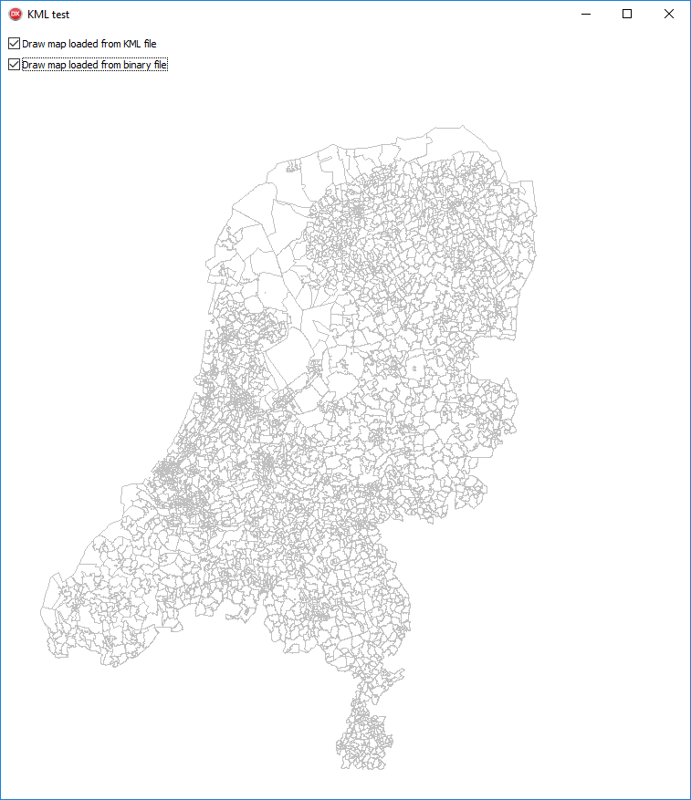

# delphi-map
Started out with a little experiment with reading KML (Keyhole Markup Language) files in Delphi, as well as caching them to a binary file for (way) faster loading.

The experiment is based on the free KML file of the Dutch postal code map (PC4), as offered by Indra:
https://indra.netlify.com/blog/2017/09/17/gratis-postcodekaart.html
which is not included in the repository. Download it, and store it as PC4.kml in the project's `Source` folder.

Mind, this is not (yet) a generic, full fledged KML loader, nor a complete map viewer. 
I'm slowly working on getting it to a useful state, for those situations where you want to visualize simple maps and don't want to buy expensive, elaborate components, or integrate it fully with Google Maps or some other external maps provider.

Currently it would look something like this, and it doesn't yet have any zooming or other interaction possibilities.

